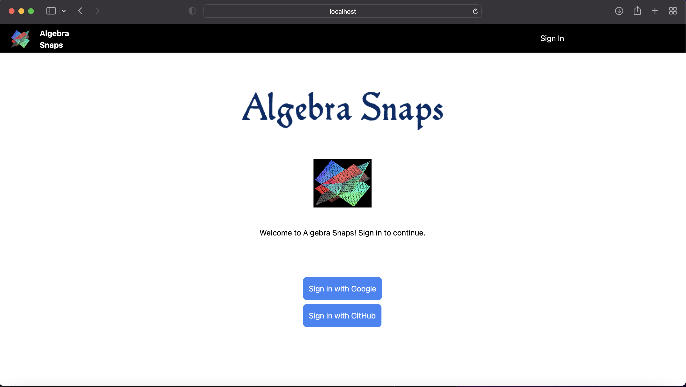
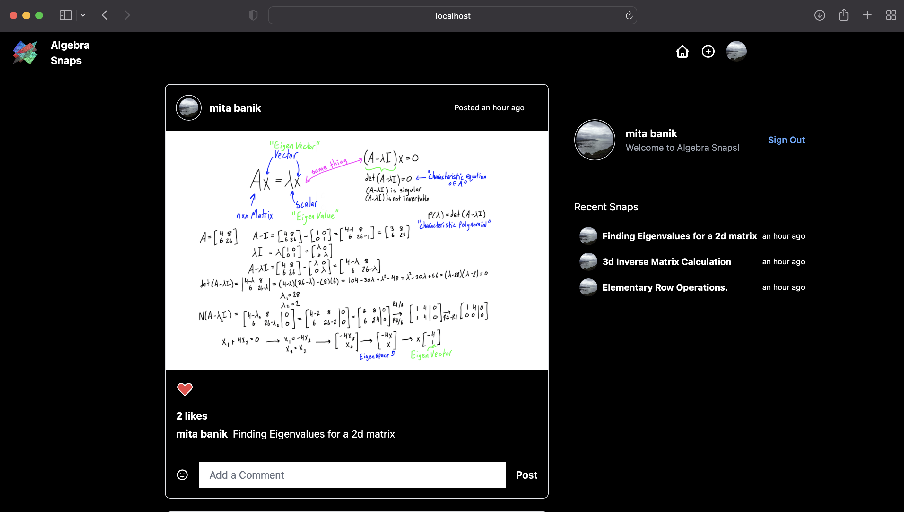

# Real Time Photo Sharing App

A beginners React project to create a real time photo sharing application using Next.js, Tailwind CSS and Firebase. I've created this app to share amoung my students in Summer to make learning Linear Algebra more fun.

## Features
- Google Sign In
- GitHuB Sign In
- Firebse Integration
- Post Photos
- Liking Photos
- Real Time Timeline Updates
- Real Time Like Updates
- Showing most recent posts

This project was done by following YouTuber Sonny Sangha's and freeCodeCamp.org's videos. Big thanks!

## Sign In

## Home Page

## Set Up

After cloning the repo, you'll need to run `npm install` to install dependencies and `npm run dev` to run the web application.
