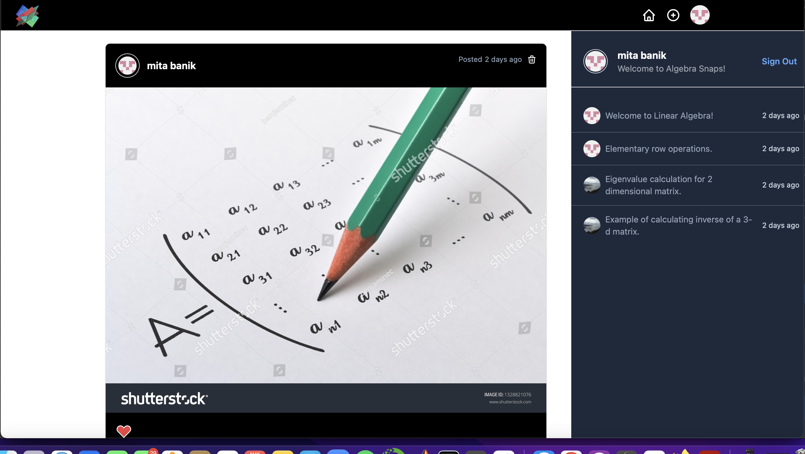

# Real Time Photo Sharing App

A beginners React project to create a real time photo sharing web application using Next.js, Tailwind CSS and Firebase. I've created this app to share among my students in Summer Quarter to make learning Linear Algebra more interactive and fun.

## Features
- Google Sign In
- GitHuB Sign In
- Post Photos
- Liking Photos
- Deleting Photos
- Real Time Timeline Updates
- Real Time Like Updates
- Adding Comments
- Deleting Comments

This project was done by following YouTuber Sonny Sangha's and freeCodeCamp.org's videos. Big thanks!

## Sign In

## Home Page

## Set Up

After cloning the repo, you'll need to run `npm install` to install dependencies and `npm run dev` to run the web application.
